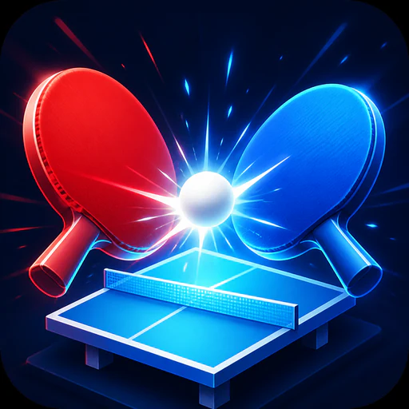

<p align="center">
  
</p>

<h1 align="center">Ping Pong</h1>

<p align="center">
  A Unity 6 single-player Pong game with difficulty scaling and persistent local leaderboards.
</p>

<p align="center">
  
  
  
</p>

## Overview

Ping Pong is a 2D arcade game where one player rallies against a computer-controlled paddle. Enter a player name, choose a difficulty, and keep the ball in play while its speed increases through the rally.

Each successful return adds one point. Sending the ball past the computer adds ten points and starts another serve; missing the ball ends the run and saves the score to the leaderboard for the selected difficulty.

This repository contains the Unity source project. It does not include a packaged, ready-to-run player build.

## Project Art

These title assets are used by the Unity menu and leaderboard scenes; they are project artwork rather than gameplay captures.

<table>
  <tr>
    <td width="50%"></td>
    <td width="50%"></td>
  </tr>
  <tr>
    <td align="center"><sub>Main menu title</sub></td>
    <td align="center"><sub>Leaderboard title</sub></td>
  </tr>
</table>

## Highlights

- **Three difficulty modes** tune ball acceleration and paddle movement for Easy, Medium, and Hard play.
- **Position-based rebounds** change the ball's vertical direction according to where it meets a paddle.
- **Persistent local scores** are stored separately for each difficulty and displayed from highest to lowest.
- **Complete scene flow** connects player setup, gameplay, and leaderboard screens.

## How to Play

1. Start from the main menu and enter a player name.
2. Select **Easy**, **Medium**, or **Hard**.
3. Move the player paddle vertically and return the ball past the AI paddle.
4. When the run ends, review the saved score on the matching difficulty leaderboard.

### Controls

| Input | Action |
| --- | --- |
| `W` or `Up Arrow` | Move the player paddle up |
| `S` or `Down Arrow` | Move the player paddle down |

## Getting Started

### Requirements

- [Unity Hub](https://unity.com/download)
- Unity Editor `6000.0.24f1`
- Git with [Git LFS](https://git-lfs.com/) enabled

### Clone and run

```bash
git clone https://github.com/Dev0910/Ping-Pong.git
cd Ping-Pong
git lfs pull
```

1. In Unity Hub, choose **Add** and select the cloned `Ping-Pong` directory.
2. Open the project with Unity Editor `6000.0.24f1`.
3. Open `Assets/Scenes/MainMenu.unity` if it is not already active.
4. Press **Play** in the Unity Editor.

## Build for Windows

1. Open **File > Build Profiles** in Unity.
2. Select the included **New Windows Profile**.
3. Switch to the Windows platform if Unity prompts you to do so.
4. Choose **Build** and select an output directory outside the repository.

The build profile includes the scenes in their intended order: `MainMenu`, `Game`, and `Leaderboard`.

## Tech Stack

- **Engine:** Unity `6000.0.24f1`
- **Language:** C#
- **Rendering:** Unity 2D feature set `2.0.1` with Universal Render Pipeline `17.0.3`
- **Input:** Input System `1.11.2`, with paddle movement mapped through Unity's `Vertical` input axis
- **Interface:** TextMesh Pro and Unity UI `2.0.0`
- **Persistence:** Json.NET `3.2.1` and JSON files under `Application.persistentDataPath`

## Project Structure

```text
Assets/
├── Scenes/                 # Main menu, gameplay, and leaderboard scenes
├── Scripts/
│   ├── Leader Board/       # Local score storage, sorting, and display
│   ├── Manager/            # Persistent game state and difficulty selection
│   ├── Movement/           # Player, AI, ball, scoring, and rebound logic
│   └── UI/                 # Name input, menus, and scene navigation
├── Settings/               # URP assets and the Windows build profile
└── Sprites/                # User-interface and game artwork
Packages/                   # Unity package manifest and lockfile
ProjectSettings/            # Unity editor, input, scene, and player settings
```

## Developer

Created by [Dev Patel](https://devp2349.wixsite.com/dev-patel-portfoli/). Explore the portfolio for more game-development work.

## License and Asset Use

This repository does not currently include a project-level license. Some bundled content comes from third-party asset packages and may be governed by separate terms. Review the original asset documentation before reusing or redistributing those files.
